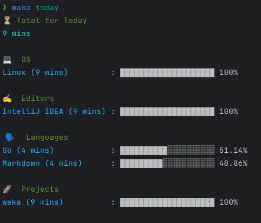
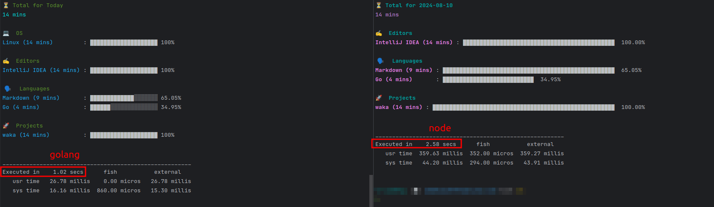

# waka

Inspired by [wakatime-cli](https://github.com/jaebradley/wakatime-cli) (not to be confused with official wakatime-cli for sending heartbeats).

Recently I had trouble installing it on new machines via npm. After a few tries it would work, something about node-gyp. Additionally, it was quite a long while since it was last updated, so I thought "why not try to reimplement this in Go."

## CLI

```bash
❯ waka
Display wakatime stats in your terminal

Usage:
  wakatime-cli [command]

Available Commands:
  completion  Generate the autocompletion script for the specified shell
  help        Help about any command
  month       Get summary for month
  today       Get summary for today
  week        Get summary for week
  yesterday   Get summary for yesterday

Flags:
  -h, --help     help for wakatime-cli
  -t, --toggle   Help message for toggle

Use "waka [command] --help" for more information about a command.
```

## Sample output



## Refs
- <https://wakatime.com/developers#summaries>
- <https://wakatime.com/developers#stats>

## Benchmark
It's faster than the original implementation in node. Because golang.

